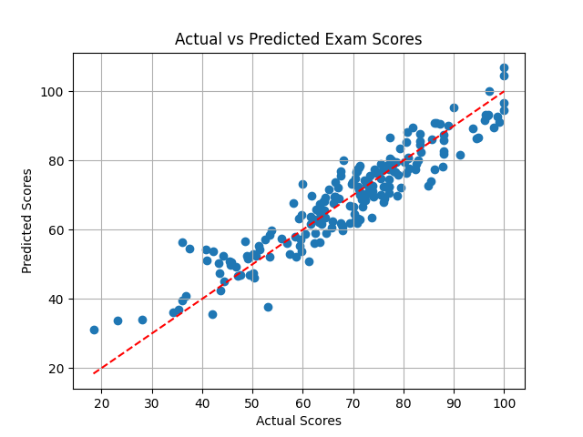

# Student Habits vs Exam Performance: Predicting Academic Scores with Linear Regression

## 📌 Project Overview

This project uses a **Linear Regression model** to predict a student's **final exam score** based on their daily habits and lifestyle factors. The goal was to demonstrate end-to-end predictive modeling using Python and scikit-learn, focusing on data cleaning, preprocessing, modeling, and visualization.

---

## 📂 Dataset

The dataset (`student_habits_performance.csv`) contains 1,000 records, each representing a student. It includes data on:

* Study time
* Sleep duration
* Social media usage
* Diet quality
* Mental health rating
* Internet quality
* Extracurricular participation
* Exercise frequency
* Final exam score

---

## 🔧 Technologies Used

* Python 3
* pandas (data manipulation)
* matplotlib (visualization)
* scikit-learn (machine learning)

---

## 📊 Step-by-Step Process

### 1. **Data Loading**

The dataset was loaded using `pandas.read_csv()`.

```python
import pandas as pd
df = pd.read_csv('student_habits_performance.csv')
```

### 2. **Initial Exploration & Cleaning**

Displayed the first few rows and checked for missing values.

Removed irrelevant columns:

* `student_id` (non-predictive)
* `gender` (not used in this model)
* `parental_education_level` (had missing values and wasn't used)

### 3. **Encoding Categorical Data**

Converted string labels to numbers using `.map()`:

```python
# Internet quality: Poor, Average, Good => 0, 1, 2
quality_map = {'Poor': 0, 'Average': 1, 'Good': 2}
df['internet_quality'] = df['internet_quality'].map(quality_map)

# Diet quality: Poor, Fair, Good => 0, 1, 2
diet_map = {'Poor': 0, 'Fair': 1, 'Good': 2}
df['diet_quality'] = df['diet_quality'].map(diet_map)

# Extracurricular participation: Yes, No => 1, 0
x['extracurricular_participation'] = x['extracurricular_participation'].map({'Yes': 1, 'No': 0})
```

### 4. **Feature Selection**

Selected the most relevant columns as input features (`x`) and the target column (`y`):

```python
x = df[[
    'age',
    'study_hours_per_day',
    'sleep_hours',
    'social_media_hours',
    'diet_quality',
    'mental_health_rating',
    'extracurricular_participation',
    'internet_quality',
    'exercise_frequency'
]]

y = df['exam_score']
```

### 5. **Train/Test Split**

Split the data into 80% training and 20% testing sets.

```python
from sklearn.model_selection import train_test_split
x_train, x_test, y_train, y_test = train_test_split(x, y, test_size=0.2, random_state=42)
```

### 6. **Model Training**

Created and trained a Linear Regression model.

```python
from sklearn.linear_model import LinearRegression
model = LinearRegression()
model.fit(x_train, y_train)
```

### 7. **Predictions and Evaluation**

Made predictions and evaluated the model using R², MAE, and MSE.

```python
from sklearn.metrics import r2_score, mean_absolute_error, mean_squared_error

y_pred = model.predict(x_test)

r2 = r2_score(y_test, y_pred)
mae = mean_absolute_error(y_test, y_pred)
mse = mean_squared_error(y_test, y_pred)
```

**Results:**

* R² Score: **0.872**
* MAE: **4.61**
* MSE: **32.89**

This means our model explains 87.2% of the variance in student exam scores and is usually within \~4.6 points of the actual score.

### 8. **Visualization**

Visualized predicted vs. actual scores:

```python
import matplotlib.pyplot as plt

plt.scatter(y_test, y_pred)
plt.plot([y_test.min(), y_test.max()], [y_test.min(), y_test.max()], color='red', linestyle='--')
plt.xlabel("Actual Scores")
plt.ylabel("Predicted Scores")
plt.title("Actual vs Predicted Exam Scores")
plt.grid(True)
plt.show()
```

The plot confirmed a strong diagonal trend — a sign of good predictions.

---

## ✅ Key Takeaways

* Data preprocessing and proper encoding are critical.
* Linear Regression worked well for this clean, structured dataset.
* The model shows high accuracy (87% R²) with low average error (\~4.6 points).

---

## 📁 How to Run

1. Install requirements: `pip install pandas scikit-learn matplotlib`
2. Place `student_habits_performance.csv` in the same folder.
3. Run the Python script.

---

## 💬 Credits

Built with the help of Artificial Intelligence and fully understood and implemented by the author.

---

## 📌 Future Improvements

* Try Decision Tree or Random Forest models
* Add more features like GPA or class attendance
* Build a Flask web app where users can input habits and get predictions

* ### 📉 Model Visualization

The plot below shows how closely the predicted scores match the actual exam scores.  
The red dashed line represents perfect predictions (Predicted = Actual):



